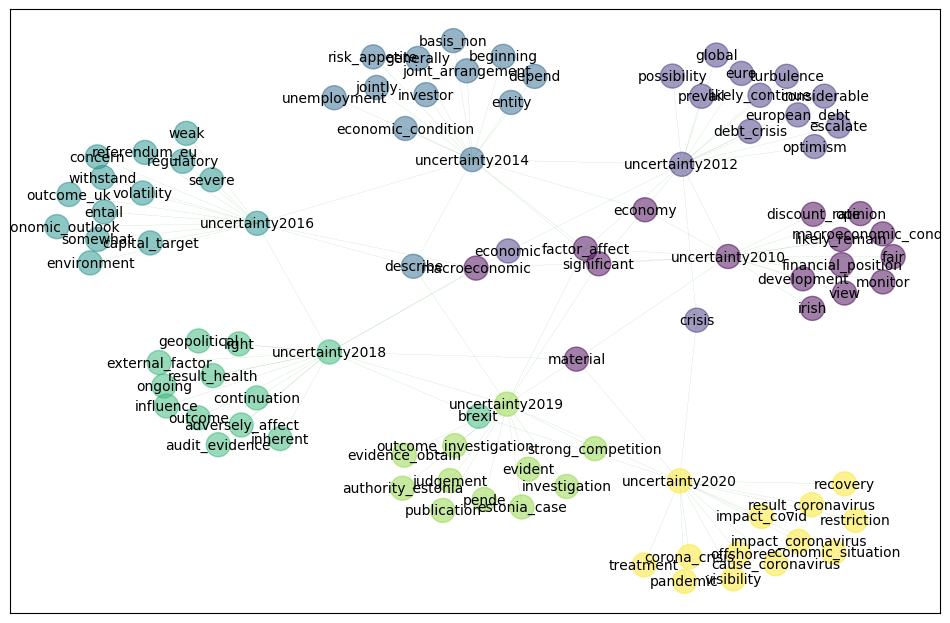

# Word-Evolution-in-Danske-Bank

The Repository contains my implementation of Word evolution using Word2Vec models from GenSim and text from Danske Bank's publicly available annual and quarterly reports.
The method can be used on any corpora of text and on any key words to track the changing context of a word over time.

It contains three notebooks:
1) A web scraper that downloads Danske Bank's PDF Reports
2) A conversion tool from PDF to txt.
3) A notebook containing the implementation of Word Evolution

### The figure below demonstrates how the context of the word 'uncertainty' changes over time in Danske Banks reports, and captures well known events from the Greek debt crisis through the Brexit referendum to the Covid pandemic.

